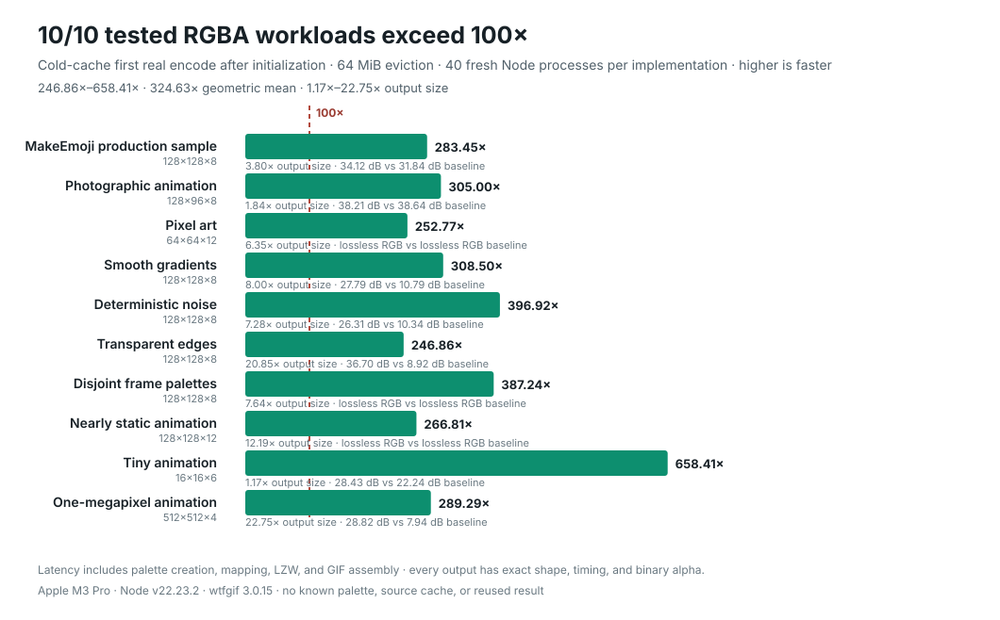

# Benchmarks

The default benchmark measures complete RGBA-to-GIF encoding across 10 real and
synthetic workloads:

```bash
npm run bench
```

## Representative corpus

Both implementations receive the same RGBA pixels and must build a global
adaptive palette of up to 256 colors, map every pixel, encode the same animation
shape and delays, and return a complete GIF. wtfgif receives one independently
allocated typed array per frame, matching the public API shape used by an app
that stitches decoded images together. Those arrays are created before timing.
The image-q + omggif baseline receives its normal contiguous RGBA input. Both
use an alpha threshold of 179. Every fixture encodes complete frames through the
public `wtfgif/encode` entry point and the equivalent image-q + omggif pipeline.

Each sample runs in a fresh Node process. Package loading and wtfgif
initialization happen before the clock; the first and only synchronous encode
of user input is timed. Initialization reserves a fixed 4 MiB input arena and
runs fixed synthetic high-color, mixed-alpha, Cartesian-grid, and exact-palette
inputs through the real encoder paths. These source-independent calls prepare
JavaScript and Wasm code during app startup. They do not inspect, key, or retain
the fixture, user pixels, palettes, or encoded results. wtfgif copies every
fixture byte into its Wasm arena after the clock starts; the baseline likewise
does all palette, mapping, and encoding work inside its timed call. After
initialization and input allocation, each process fills 64 MiB of unrelated
memory and yields one zero-delay event-loop turn without touching the encoder
or fixture. There are zero fixture-derived warmups and no prior encode results
retained between processes. Encoder order alternates by fixture and process,
and each worker loads only the implementation it is measuring. Validation and
quality measurement are outside the clock. Results below are medians from 40
processes per implementation on an Apple M3 Pro with Node.js 22.23.2.

The encoded artifacts were built from clean commit
`e89983b7fa46e4d1e6f24d81c9a35416b65c6bfb`. The receipt records package
version 3.0.12, a clean worktree, and the complete runtime environment.

| Fixture | Shape | wtfgif | image-q + omggif | Speedup | File-size ratio |
| --- | ---: | ---: | ---: | ---: | ---: |
| MakeEmoji production sample | 128×128×8 | 0.603 ms | 146.387 ms | **242.86×** | 3.80× |
| Photographic animation | 128×96×8 | 0.284 ms | 74.029 ms | **260.32×** | 1.84× |
| Pixel art | 64×64×12 | 0.109 ms | 27.760 ms | **254.00×** | 6.35× |
| Smooth gradients | 128×128×8 | 0.426 ms | 131.533 ms | **308.73×** | 8.00× |
| Random noise | 128×128×8 | 0.275 ms | 106.438 ms | **386.46×** | 7.28× |
| Transparency | 128×128×8 | 0.219 ms | 47.984 ms | **219.40×** | 20.85× |
| Disjoint frame palettes | 128×128×8 | 0.166 ms | 67.134 ms | **405.23×** | 7.64× |
| Nearly static animation | 128×128×12 | 0.310 ms | 83.518 ms | **269.23×** | 12.19× |
| Tiny animation | 16×16×6 | 0.082 ms | 54.481 ms | **661.38×** | 1.17× |
| One-megapixel animation | 512×512×4 | 1.934 ms | 563.401 ms | **291.33×** | 22.75× |

The observed range is 219.40×–661.38×, with a 312.34× geometric-mean speedup.
The corresponding files are 1.17×–22.75× larger, with a 6.50× geometric mean.
This is the library's intended tradeoff: encode latency takes priority over
compression ratio.

These results describe the ten committed fixtures on the recorded Apple M3
Pro and Node.js runtime. They do not claim codec-only performance, equal output
size, or unmeasured hardware and runtimes.

Every category exceeds the 100× floor on its first real encode after
initialization. Transparency has the narrowest margin at 219.40×, followed by
the MakeEmoji production sample at 242.86×.
No result depends on a known palette, source cache, previous result, or
reduced-quality mode.



The chart is generated from the same receipt as the table with
`npm run bench:charts`. Bar length represents speedup over image-q + omggif;
the secondary label reports the output file-size ratio and source-relative RGB
quality for both encoders. “Lossless RGB” means every source-opaque RGB pixel
survived palette mapping exactly. Shape, frame timing, and binary alpha must be
exact on every fixture regardless of that RGB label.

The baseline uses image-q `rgbquant` palette generation and nearest-color
mapping followed by omggif LZW. wtfgif uses its global quality quantizer and
literal LZW. The algorithms can select different indexed pixels, so the receipt
reports output bytes, opaque-source RGB PSNR, and per-frame SSIM after binary
alpha compositing against black. Every output is decoded and checked for shape,
frame count, delays, and exact binary alpha before it is accepted.

[`benchmarks/corpus.json`](benchmarks/corpus.json) records all raw samples,
medians, p95 values, output hashes, quality values, fixture hashes and
provenance, package-lock hash, commit, dirty state, and runtime environment.
The corpus covers real small images, photographic content, flat pixel art,
gradients, noise, transparency, disjoint frame palettes, similar adjacent
frames, tiny animations, and a one-megapixel workload. Add the optional
three-megapixel fixture with `npm run bench:corpus:stress`.

## Runtime preparation and cold-cache check

Explicit initialization performs fixed synthetic encodes to compile and tier
the actual JavaScript and Wasm paths before the app's first user encode. The
inputs are constants in the library; they are not derived from the benchmark
fixture or any user image. Initialization does not build a source-keyed palette
or output cache. The current initialization also exercises the independently
allocated frame-array path with one fixed two-pixel animation. Across 20 fresh,
cache-evicted MakeEmoji processes, that final preparation reduces the first
separate-frame encode from 0.713 ms to 0.604 ms, a **1.180×** end-to-end gain
with identical GIF bytes.

The earlier committed preparation profiler isolates the SIMD palette-planner
work that preceded this separate-frame change. Its receipt touched one byte per
cache line in a 64 MiB unrelated-memory arena after initialization and before
timing either implementation. The current profiler fills the entire arena and
yields one event-loop turn before timing so future diagnostics match the corpus
boundary more closely. Against
the clean 3.0.11 encoder and with the same source-independent preparation on
both sides, 180 fresh MakeEmoji pairs measured **1.1349×** faster inside Wasm
and **1.1272×** faster end to end.
The baseline and candidate emitted the same SHA-256 hash. A separate 220-pair
transparent single-merge screen was neutral inside Wasm and **1.0523×** faster
end to end, also with identical bytes. Raw medians, paired ratios, and hashes
are in
[`benchmarks/runtime-preparation.json`](benchmarks/runtime-preparation.json).

## Independent correctness checks

```bash
npm run test:conformance:independent
npm run test:conformance:browsers
npm run fuzz:smoke
```

The independent conformance check encodes every corpus fixture with scalar and
SIMD Wasm, requires byte-for-byte agreement between them, and validates the
results through both omggif and Sharp/libvips. The browser check compares the
first rendered frame from Chromium, Firefox, and WebKit with the independent
decoder pixels. Property tests cover 200 deterministic arbitrary indexed and
RGBA animations. Bounded libFuzzer targets exercise malformed decoding and
encode-then-decode round trips; the local smoke check runs 500 cases per target.

CI is configured for Node 20 and 22 on Linux, Node 22 on macOS and Windows, all
three browser engines on Linux, and weekly 10,000-case fuzz runs. These checks
support file validity and rendering compatibility; they do not make the two
quantizers pixel-identical.

## Browser encoder race

```bash
npm run bench:race
```

This comparison uses the same eight real 128×128 MakeEmoji RGBA frames and an
alpha threshold of 179. Package code, the fixture fetch, and wtfgif's one-time
initialization happen before the clock. The timed boundary includes
palette creation, pixel mapping, GIF compression, and final byte assembly.

Each sample is the first and only encode in a fresh, cross-origin-isolated
Chrome process and fresh browser profile. During untimed initialization,
wtfgif reserves its generic input arena and runs the same fixed synthetic
runtime preparation described above. The harness creates wtfgif's eight
independent frame arrays, fills 64 MiB of unrelated memory, and waits one
`requestAnimationFrame` without touching encoder code or fixture pixels. It
then copies the frames into Wasm and performs all palette, mapping, compression,
and assembly work after the clock starts. There are no fixture-derived warmups,
image-derived retained state, or results reused between samples. The six
encoders run in a rotating order to reduce thermal and ordering bias. Results
below are medians from 15 processes per encoder on an Apple M3 Pro in Google
Chrome 151.0.7922.77.

This is public-API time-to-result, not a codec-kernel microbenchmark or an
equal-file-size comparison. The
gif.js and gif.js.optimized APIs create workers when `render()` begins, so that
worker creation is inside their timed jobs. The README chart uses bar length
for median encode time, marks 100× wtfgif latency with a dashed reference line,
and prints each encoder's emitted GIF size, relative slowdown, PSNR, and alpha
agreement beside the time.

| Implementation | Version | Median | wtfgif advantage | Bytes | PSNR | Alpha match |
| --- | ---: | ---: | ---: | ---: | ---: | ---: |
| **wtfgif** | 3.0.12 | **0.725 ms** | — | 149,689 | 34.12 dB | 100% |
| gif.js | 0.2.0 | 95.055 ms | **131.11×** | 80,869 | 33.08 dB | 99.78% |
| image-q + omggif | 2.1.2 + 1.0.10 | 100.790 ms | **139.02×** | 39,350 | 31.84 dB | 100% |
| gif.js.optimized | 1.0.1 | 107.945 ms | **148.89×** | 80,304 | 32.20 dB | 99.76% |
| gifenc | 1.0.3 | 125.975 ms | **173.76×** | 39,101 | 34.54 dB | 100% |
| modern-gif | 2.1.0 | 138.480 ms | **191.01×** | 43,114 | 32.65 dB | 100% |

Every output must parse as an eight-frame 128×128 animation with exact 100 ms
delays before its sample is accepted. The validator composites all frames,
measures RGB PSNR on source-opaque pixels, and measures binary alpha agreement
over every pixel. Raw timings and interquartile values are committed in
[`benchmarks/encoder-race.json`](benchmarks/encoder-race.json); the README chart
is generated from that receipt by `scripts/render-encoder-race-chart.mjs`.

Regenerate both committed SVG charts from their receipts with:

```bash
npm run bench:charts
```

The adapters use each package's highest-color normal path:

- wtfgif, modern-gif, gifenc, and image-q + omggif build one adaptive palette
  across all eight frames. gifenc uses its higher-quality RGB565 mode.
- gif.js and gif.js.optimized use their highest-quality `quality: 1` setting,
  two workers, and their normal per-frame NeuQuant palettes. Their public API
  spawns workers from `render()`, so worker creation is part of their timed job.
- GIF has one-bit transparency. wtfgif, gifenc, modern-gif, and the omggif
  pipeline apply the same threshold exactly. gif.js and gif.js.optimized only
  expose color-key transparency; the adapter supplies a reserved key, and the
  measured 99.78%/99.76% alpha agreement records the resulting collisions.
- gifenc and modern-gif ignore typed-array byte offsets internally. The adapter
  therefore copies each contiguous fixture frame into its own correctly sized
  view inside the timed boundary. This preserves correct pixels instead of
  giving either package a broken-but-fast result.

The raw gif.js outputs contain their package's normal zero padding after the
GIF trailer. The benchmark reports those bytes as emitted and validates them
with omggif, which accepts that widely tolerated padding.

## Earlier single-workload measurements

These retained release-3.0.6 receipts document narrower throughput, stress,
indexed-input, and decode contracts. They are historical context, not the
current 10-fixture headline result above.

The committed workload is eight real images from MakeEmoji. Each image was
aspect-fitted into a transparent 128×128 canvas, then stored as one contiguous
RGBA fixture at `test/rgba/makeemoji-128x128x8.rgba`.

The clock starts with that RGBA buffer. Both implementations must create a
palette, map every source pixel, and compress every frame. File loading, image
decoding, resizing, WebAssembly initialization, warmup, validation, and quality
measurement are outside timed samples.

Results below are medians from 200 samples after 30 timed-loop warmups on an
Apple M3 Pro with Node.js 22.23.2, measured on release 3.0.6.

| Implementation | Median | Speedup | Bytes | PSNR |
| --- | ---: | ---: | ---: | ---: |
| image-q rgbquant + omggif balanced LZW | 94.900 ms | 1.00× | 39,350 | 31.84 dB |
| wtfgif quality/global + literal LZW | 0.330 ms | **287.47×** | 149,689 | 34.12 dB |

This is one practical adaptive global-palette pipeline. The implementations do
not choose identical pixels, so the table reports source-relative PSNR and
output bytes alongside speed. The wtfgif palette is higher quality on this
fixture while remaining 287.47× faster. Literal LZW is lossless for the
indexed pixels, so the speedup does not come from lowering GIF pixel quality.

The quality path keeps exact source colors when a small palette is sufficient.
Its low-resolution first-encode path uses a weighted 4-bit-per-channel
histogram for ordinary photo-like, noisy, and smooth inputs. Occupied coarse
cells map directly when they fit the GIF palette; a one-cell overflow uses a
targeted weighted merge, while other dense inputs use the general adaptive
planner. Larger inputs can use a finer histogram. These are internal
input-dependent optimizations, not user-selectable quality levels, and none
reuse a prior source or palette.

For ordinary-sized inputs (up to one million pixels), the alpha check is
fused into that histogram pass. Multi-megapixel inputs use a separate tight
alpha preflight because it is faster than branching on transparency during
scattered histogram updates.

The same source with every pixel treated as opaque (`BENCH_ALPHA_THRESHOLD=0`)
took 109.245 ms for image-q + omggif and 0.383 ms for wtfgif: **285.36×**.
wtfgif measured 33.91 dB versus 32.44 dB for the baseline. This is the normal
full-color, no-transparent-pixels case.

In a separate 10-sample run after three timed-loop warmups, the larger stress
workload (ten synthetic 512×512 RGBA frames) measured
6,465.213 ms for image-q + omggif and 4.075 ms for wtfgif: **1586.44×**,
with 2,973,381 output bytes and 26.19 dB PSNR versus 24.26 dB for the
baseline. This is still arbitrary RGBA input: the palette is unknown, every
pixel is scanned, and every indexed pixel is emitted into a valid GIF.
The 1586.44× ratio is a workload-size effect, not a cache shortcut: both sides
read all 2,621,440 source pixels, while wtfgif keeps its histogram, parent-cell
lookup, and literal writer linear in the input size.

For the no-warmup, first-real-encode contract:

```bash
BENCH_ITERATIONS=500 BENCH_INITIALIZED_FIRST=1 BENCH_PHASES=1 npm run bench:rgba:cold:encode
```

That run starts a fresh Node process for every sample, initializes Wasm, and
then times exactly one real encode with no warmup. Across 500 processes the
median was 127.979 ms for image-q + omggif versus 1.257 ms for wtfgif
(**101.83×**). There is no synthetic encode, retained source pixel, palette, or
output result in initialization. The parent-observed wall clock, which also
includes launching and shutting down Node, was 171.766 ms versus 29.610 ms
(**5.80×**). Median wtfgif phases were 0.212 ms to load the fixture, 0.430 ms
to import the package, 0.893 ms to initialize Wasm, and 1.257 ms for the first
encode.

Run the optional larger synthetic stress workload with:

```bash
npm run bench:rgba:stress
```

For a stress-only receipt, add `BENCH_COLD_RGBA_FIXTURE=stress`. Across five
fresh processes, the first encode after initialization took 6,409.521 ms with
image-q + omggif and 8.668 ms with wtfgif: **739.45×**. The complete process
wall clock was 6,491.454 ms versus 60.287 ms: **107.68×**. The wtfgif output
remains 2,973,381 bytes at 26.19 dB PSNR. The large image-q allocation makes this
workload noisy, so use several samples and report the median.

## Specialized: already-indexed frames

```bash
BENCH_ITERATIONS=100 BENCH_WARMUP_ITERATIONS=10 BENCH_TARGET_SAMPLE_MS=5 \
BENCH_COLOR_COUNTS=2,4,8,16,32,64,128,256 npm run bench:encode
```

This is the direct `GifWriter` contract: 12 full 128×128 frames, a normal
256-color global palette, and typed output. wtfgif always uses literal LZW.

| Implementation | Median | Bytes |
| --- | ---: | ---: |
| omggif | 15.827 ms | 163,797 |
| wtfgif | 0.083 ms | 224,001 |
| **Speedup** | **190.56×** | **1.37× baseline** |

Both outputs are decoded before timing and must produce exactly the same RGBA
pixels. This is a real 100× result, but it applies only after palette creation
and pixel indexing have already happened.

The same typed-output sweep across 2, 4, 8, 16, 32, 64, 128, and 256-color
palettes measured a minimum of **157.57×** (2 colors) and a geometric mean of
**262.84×** in the latest 100-sample receipt. Palettes through 64 colors use
the fixed-width 8-bit literal writer; all output still decodes to the same
indexed pixels, though the packed stream can be smaller.

## Decode

```bash
BENCH_ITERATIONS=50 BENCH_WARMUP_ITERATIONS=8 BENCH_TARGET_SAMPLE_MS=5 npm run bench:decode
```

Reader construction, GIF parsing, and decoding every composited RGBA frame are
inside each sample. One caller-owned RGBA buffer is reused, matching ordinary
omggif usage. Every final byte must match omggif before timing.

| Fixture | Shape | omggif | wtfgif | Speedup |
| --- | ---: | ---: | ---: | ---: |
| GIGACHAD | 198 × 128×128 | 29.504 ms | 14.748 ms | **2.00×** |
| tenor | 16 × 498×498 | 34.488 ms | 6.607 ms | **5.22×** |

The latest all-fixture sweep ranged from **1.03×** on the tiny Clap fixture to
**5.22×** on tenor, with a **2.68× geometric mean**. Every decoded
byte was still checked for composited RGBA parity. For 8+ frame animations,
medium rectangles use the initialized reusable Wasm blitter after the reader
has a clear animation-shaped access pattern. Single-frame and sub-512-pixel
reads stay on JavaScript.

For large canvases with partial transparent rectangles, the drop-in reader can
decode only the frame rectangle into Wasm scratch storage and overlay it onto
the caller's canvas. This avoids copying the full canvas through Wasm on every
frame while preserving RGBA/BGRA pixels exactly; the path is covered by the
large-partial-frame parity test in `test/index.test.ts`.

Prepared Wasm playback keeps full-frame and delta streams in Wasm-owned
scratch views until `dispose()`, avoiding a second whole-animation copy through
the wasm-bindgen return layer. This changes storage ownership, not pixels; the
same parity tests cover RGBA and BGRA output.

The one-off `decodeGifFramesRgba` API has an additional direct-output path for
animations whose frames are all full-canvas and opaque. On the same tenor GIF,
20 fresh-process samples measured 40.699 ms for omggif versus 1.430 ms for
wtfgif (**28.45×**).
That optimization does not change the drop-in reader's frame-by-frame contract.

The old process-startup diagnostic remains available as `npm run bench:cold`.
It measures a different contract and is intentionally not the headline race.
