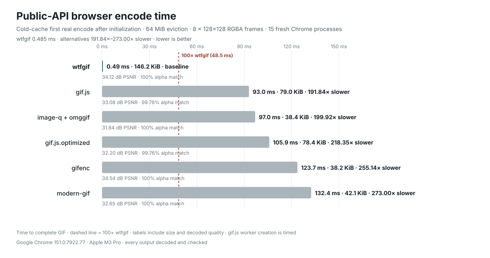

# wtfgif

`wtfgif` makes and reads GIF files in Node.js, browsers, Workers, and edge
runtimes. Its single encoder is optimized for maximum speed at the cost of
larger files. There are no compression or quality modes.

On the current 10-workload cold-cache receipt, the first and only encode after
initialization is **248.58×–666.15× faster** than image-q + omggif. The
resulting files are **1.17×–22.75× larger**. The benchmark includes arbitrary
RGBA photographs, pixel art, gradients, transparency, noise, tiny animations,
and a one-megapixel animation—not known palettes, cached pixels, reused
palettes, or cached results.
wtfgif receives one independently allocated RGBA array per frame, matching a
normal image-stitching app. Neither encoder is given a palette: each must
discover and map its own palette from the RGBA pixels. Every GIF is decoded and
checked before its timing is accepted.

- To make a GIF, give it one or more images as RGBA pixel arrays.
- To read a GIF, give it the file bytes and get RGBA pixel arrays back.

```bash
npm install wtfgif
```

## Make a GIF

This example creates a two-frame GIF and saves it in Node.js:

```ts
import { writeFile } from "node:fs/promises";
import { encodeRgbaGifFrames, initializeWasmGlobally } from "wtfgif/encode";

await initializeWasmGlobally(); // Do this once when your app starts.

const width = 128;
const height = 128;

function solidFrame(red: number, green: number, blue: number) {
	const frame = new Uint8Array(width * height * 4);
	for (let i = 0; i < frame.length; i += 4) {
		frame.set([red, green, blue, 255], i);
	}
	return frame;
}

const gif = encodeRgbaGifFrames({
	width,
	height,
	frames: [solidFrame(255, 0, 0), solidFrame(0, 0, 255)],
	delay: 50, // 50 hundredths of a second = 500 ms per frame
	loop: 0, // Repeat forever
});

await writeFile("output.gif", gif);
```

Each frame must contain `width * height * 4` bytes: red, green, blue, and
alpha for every pixel. In a browser, `canvas.getContext("2d").getImageData()`
provides pixels in this format.

## Read or process a GIF

`preparePlayback()` gives you complete frames with GIF transparency and frame
placement already handled:

```ts
import { readFile } from "node:fs/promises";
import { GifReader } from "wtfgif";

const file = await readFile("input.gif");
const reader = new GifReader(file);
const decoded = reader.preparePlayback();

console.log(reader.width, reader.height, reader.numFrames());

for (let i = 0; i < reader.numFrames(); i += 1) {
	const rgba = new Uint8Array(reader.width * reader.height * 4);
	decoded.copyFrame(i, rgba);

	// Read, edit, resize, analyze, or draw this frame here.
	console.log(`frame ${i}: ${decoded.frames[i]!.delay * 10} ms`, rgba);
}

decoded.dispose();
reader.dispose();
```

To save edited frames as a new GIF, collect the changed RGBA arrays and pass
them to `encodeRgbaGifFrames()`. Use the decoded frame delays and
`reader.loopCount()` if you want to preserve the original timing.

In a browser, get GIF bytes with
`new Uint8Array(await file.arrayBuffer())`. To turn encoded bytes into a file
or URL, use `new Blob([gif], { type: "image/gif" })`.

## Browser and edge runtimes

The fast encoder is WebAssembly. In Node.js and regular browser bundlers, call
the same `initializeWasmGlobally()` function shown above once during app or
worker startup. It selects SIMD when the runtime supports it and otherwise uses
the scalar Wasm build. Encoding is synchronous after that promise resolves.

Cloudflare Workers, Vercel Edge, and other runtimes that require a static Wasm
module can initialize that module explicitly:

```ts
import { encodeRgbaGifFrames, initializeWasmModule } from "wtfgif/encode";
import initWasm, * as wasm from "wtfgif/wasm-encode";
import wasmModule from "wtfgif/wasm-encode/wasm";

await initializeWasmModule({ ...wasm, default: initWasm }, wasmModule);
```

No native addon is required in any of these environments.

## Speed and output size

The default benchmark starts a fresh Node process for every sample, completes
wtfgif's one-time initialization before the clock, and then times the first and
only user-input encode. Palette creation, pixel mapping, LZW, and complete GIF
assembly are timed. Package loading and initialization are not. Before timing,
the harness evicts 64 MiB of unrelated memory and yields one event-loop turn
without touching the encoder or fixture.

Initialization prepares code with fixed synthetic inputs and reserves a generic
4 MiB Wasm input arena. It never inspects or retains user pixels, palettes, or
encoded results. The exact preparation A/B receipts live in
[BENCHMARKS.md](BENCHMARKS.md); they are kept out of the headline result above.

Across the 10 arbitrary-RGBA workloads, wtfgif is **248.58×–666.15× faster**
than image-q + omggif, with a **344.21× geometric mean**. The real 128×128
MakeEmoji workload is **325.94× faster** (0.459 ms vs 149.675 ms). Output files
are **1.17×–22.75× larger**, with a **6.50× geometric mean**.


Bar length is speedup over image-q + omggif; every label also reports both
median encode times, the file-size ratio, and source-relative RGB quality for
wtfgif and the baseline.
Both the chart and values above are generated from the clean 40-process
[`benchmarks/corpus.json`](benchmarks/corpus.json) receipt. Shape, frame timing,
and binary transparency must be exact; PSNR and SSIM expose the unavoidable
color reduction when arbitrary RGBA pixels become a GIF palette.

The receipt identifies wtfgif 3.0.19 at clean source commit
`b5faf9383ef5fe2a4a94cc9a5d53dc7be019644b`.

Current profiling puts about **89%** of the MakeEmoji first-encode latency
inside the Wasm encoder. Reserving its arena, copying the independent RGBA
frames in, and copying the GIF out together take about 0.05 ms. Within Wasm,
the remaining work is concentrated in palette-histogram construction,
nearest-palette mapping, and literal LZW emission. Those are the active
optimization targets; the JavaScript boundary is no longer the bottleneck.
The phase timings, sampling method, and rejected exact-output experiments are
recorded in [BENCHMARKS.md](BENCHMARKS.md).

## Browser comparison



These are public-API time-to-result medians from 15 fresh Chrome processes per
encoder on the same eight-frame MakeEmoji workload. Package loading and wtfgif
initialization are outside the clock. Each process evicts 64 MiB of unrelated
memory and waits one animation frame before timing. wtfgif took **0.580 ms**;
the five alternatives took **97.295–139.080 ms** and were
**167.75×–239.79× slower**.
wtfgif emitted 149,689 bytes; the alternatives emitted 39,101–80,869 bytes.
The dashed line marks 100× wtfgif's measured latency. The chart reports output
size, PSNR, and alpha agreement beside every timing, so the speed claim is not
separated from its size and fidelity tradeoffs. gif.js worker creation is part
of its public timed operation. Exact settings and raw samples are in
[BENCHMARKS.md](BENCHMARKS.md).

The raw receipt is [`benchmarks/encoder-race.json`](benchmarks/encoder-race.json),
and the chart above is generated from it by
`scripts/render-encoder-race-chart.mjs`.

```bash
npm run bench
npm run bench:race
npm run bench:charts
```

These receipts support the exact workloads, hardware, runtimes, and timing
boundaries shown here; they are not codec-only or matched-file-size claims.
Exact conditions, raw samples, output sizes, PSNR, SSIM, independent-decoder
checks, and browser checks are in [BENCHMARKS.md](BENCHMARKS.md).

## Good to know

- GIF delays use hundredths of a second, so `delay: 10` means 100 ms.
- GIF supports at most 256 colors and only fully transparent or fully opaque
  pixels. Converting from full-color RGBA always involves some color reduction.
- Encoding always uses wtfgif's latency-first literal-LZW path. Smaller output
  is not an alternate mode of this library.
- `GifReader` and `GifWriter` are compatible with the equivalent `omggif` APIs
  if you need lower-level palette and frame control.

[Benchmarks](BENCHMARKS.md) · [MIT license](LICENSE)
