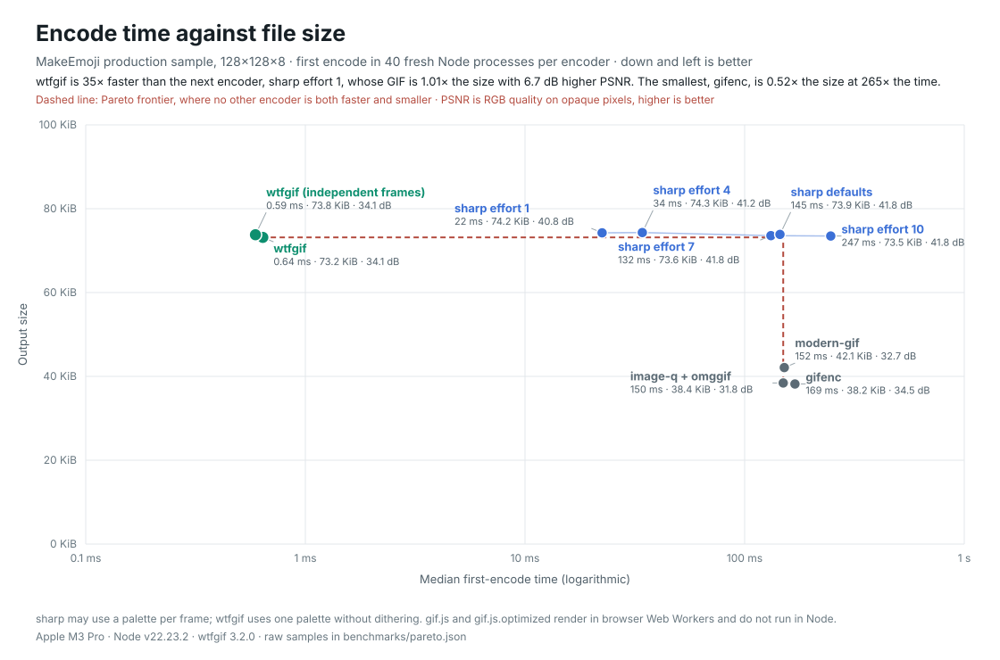

# wtfgif

[](https://www.npmjs.com/package/wtfgif)
[](https://github.com/mpopv/wtfgif/actions/workflows/ci.yml)
[](LICENSE)

Fast GIF encoding and omggif-compatible decoding for Node.js, browsers, Web
Workers, and edge runtimes.

wtfgif turns RGBA frames into an animated GIF in well under a millisecond at
sticker and emoji sizes, more than 100 times faster than the JavaScript
encoders it is benchmarked against and faster than sharp's native libvips
encoder on every benchmark workload. Its two modes trade time for bytes:
`"fastest"`, the default, and `"smallest"`, which writes files about 40%
smaller in about twice the time and is still faster than every benchmarked
alternative. Both decode to the same pixels: one palette per animation, so an
encoder that picks a palette for each frame looks better. The result is a
standard GIF that every browser and image library can read.

- **Fast.** A Rust/WebAssembly encoder, with SIMD where the runtime has it.
- **Lossless after the palette.** One adaptive palette per animation, exact
  frame delays, and exact binary transparency. Run codes, full-dictionary LZW
  in the smallest mode, and changed-area frames keep files compact without
  changing a decoded pixel.
- **A drop-in for omggif.** `GifReader` and `GifWriter` take the same
  arguments and return the same values.
- **Runs anywhere.** Node.js, browsers, Web Workers, Cloudflare Workers, and
  Vercel Edge. No native addon.
- **Typed.** Ships its own TypeScript declarations.

## Install

```sh
npm install wtfgif
```

## Quick start

```ts
import { writeFile } from "node:fs/promises";
import { encodeRgbaGifFrames, initializeWasmGlobally } from "wtfgif/encode";

await initializeWasmGlobally(); // Once, when your app starts.

const width = 64;
const height = 64;
const red = new Uint8Array(width * height * 4);
const blue = new Uint8Array(width * height * 4);
for (let i = 0; i < red.length; i += 4) {
  red.set([255, 0, 0, 255], i);
  blue.set([0, 0, 255, 255], i);
}

const gif = encodeRgbaGifFrames({
  width,
  height,
  frames: [red, blue],
  delay: 50, // Hundredths of a second: 50 is 500 ms per frame.
  loop: 0, // Repeat forever.
  // mode: "smallest", // About 40% smaller files in about twice the time.
});

await writeFile("out.gif", gif);
```

Each frame holds `width × height × 4` bytes of red, green, blue, and alpha:
the same layout as `ImageData.data`.

### From a canvas

```ts
import { encodeRgbaGifFrames, initializeWasmGlobally } from "wtfgif/encode";

await initializeWasmGlobally();

const canvas = document.createElement("canvas");
canvas.width = 128;
canvas.height = 128;
const context = canvas.getContext("2d", { willReadFrequently: true })!;

const frames = images.map((image) => {
  context.clearRect(0, 0, canvas.width, canvas.height);
  context.drawImage(image, 0, 0, canvas.width, canvas.height);
  return context.getImageData(0, 0, canvas.width, canvas.height).data;
});

const gif = encodeRgbaGifFrames({ width: 128, height: 128, frames, delay: 10, loop: 0 });
const url = URL.createObjectURL(new Blob([gif], { type: "image/gif" }));
```

### Decode a GIF

```ts
import { readFile } from "node:fs/promises";
import { GifReader, initializeWasmGlobally } from "wtfgif";

await initializeWasmGlobally(); // Optional: prepares frames in WebAssembly.

const reader = new GifReader(await readFile("in.gif"));
const playback = reader.preparePlayback(); // Every frame composited, disposal applied.

for (let i = 0; i < reader.numFrames(); i++) {
  const rgba = new Uint8Array(reader.width * reader.height * 4);
  playback.copyFrame(i, rgba);
  console.log(`frame ${i} shows for ${playback.frames[i].delay * 10} ms`);
}

playback.dispose();
reader.dispose();
```

## Replacing omggif

Change the import:

```diff
- import { GifReader, GifWriter } from "omggif";
+ import { GifReader, GifWriter } from "wtfgif";
```

`GifReader` and `GifWriter` have omggif's constructors, methods, and return
values, and accept the same plain arrays, typed arrays, and Node.js buffers.
Decoded pixels match omggif's exactly. Two things differ:

- `GifWriter` writes LZW codes without building omggif's full dictionary, so
  it is much faster and its files are larger.
- `GifReader` decodes in WebAssembly when it is available: in Node.js the
  module loads on first use, and in browsers after
  `await initializeWasmGlobally()`. Until then it uses JavaScript. Both produce
  the same pixels.

Beyond omggif, `GifReader` adds `preparePlayback()` for composited frames and
`decodeAndBlitCompositedFrameRGBA()` for one composited frame.

## Performance and tradeoffs

<!-- benchmark:readme-corpus:start -->
On 10 arbitrary-RGBA workloads, wtfgif's first encode is **119×–593× faster**
than image-q + omggif (**230× geometric mean**) and **13×–132× faster** than
[sharp](https://sharp.pixelplumbing.com/), the native libvips encoder, at its fastest setting (**36× geometric mean**).
The real 128×128×8 MakeEmoji animation takes **0.66 ms**, against
154 ms for image-q + omggif and 23 ms for sharp. wtfgif's files are 0.37×–22.42× the size of
image-q + omggif's (1.99× geometric mean) and 0.41×–2.46× the size of sharp's
(1.18×). sharp, which can choose a palette for each frame, measures higher
RGB quality on 6 of the 10 workloads.

With `mode: "smallest"`, the same pixels take 0.41×–0.95× the bytes of the fastest
mode (**0.62× geometric mean**) and 2.1× its time. That is still **59×–412×**
faster than image-q + omggif and **4×–46×** faster than sharp, with files
1.23× and 0.73× their size (geometric means). MakeEmoji takes
1.33 ms and 40 KiB.


Measured on an Apple M3 Pro with Node.js 22.23.2: 40 fresh processes per
workload and library, wtfgif 3.3.0 at `84eda6f`. Raw samples are in
[`benchmarks/corpus.json`](benchmarks/corpus.json).
<!-- benchmark:readme-corpus:end -->

### Speed against file size

<!-- benchmark:readme-pareto:start -->


The same MakeEmoji animation through every encoder that runs in Node, with
sharp at four effort levels. On the frontier, where no other encoder is both
faster and smaller: wtfgif fastest, wtfgif smallest, image-q + omggif, and gifenc. Labels give RGB
PSNR, since size alone does not show palette quality. Medians of 40 fresh processes per
encoder; raw data in [`benchmarks/pareto.json`](benchmarks/pareto.json). gif.js
needs browser workers, so it appears only in the Chrome comparison below.
<!-- benchmark:readme-pareto:end -->

### In the browser

<!-- benchmark:readme-browser:start -->


Encoding the same 8-frame 128×128 MakeEmoji animation through each library's
public API in Chrome 154.0.8037.98, wtfgif took **0.69 ms** (73 KiB) in its fastest mode and
**1.30 ms** (40 KiB) in its smallest mode. The other five took
90–136 ms (**132×–198× slower than the fastest mode**)
and wrote 38 KiB–79 KiB. Medians of 15 fresh browser processes
per encoder; raw data in [`benchmarks/encoder-race.json`](benchmarks/encoder-race.json).
<!-- benchmark:readme-browser:end -->

### What you give up for speed

- **Larger files in the fastest mode.** The default codes runs of one color
  and stores only the changed part of each frame, but skips full LZW dictionary
  matching. Flat art, transparent backgrounds, and mostly static animations
  shrink a lot; photographic and noisy frames stay near their uncompressed
  size. `mode: "smallest"` adds full-dictionary LZW and keeps whichever stream
  is shorter, at about twice the encode time; see the benchmarks below.
- **One palette, no dithering.** GIF allows a separate 256-color palette per
  frame, and encoders can dither to fake missing colors. wtfgif builds one
  palette from all frames and gives each pixel its nearest color. That's
  faster and keeps files small, but smooth gradients can band. sharp, which can
  choose a palette for each frame, measures higher RGB quality on most
  benchmark workloads.
<!-- benchmark:readme-startup:start -->
- **Startup work.** `initializeWasmGlobally()` loads WebAssembly and runs fixed
  synthetic encodes so that your first real encode is fast. Loading the package
  and initializing took **29 ms** (median across 400 fresh processes),
  once per process and outside the timed encodes above. Do it at startup, not
  right before your first GIF. If each process encodes a single GIF, as in a
  cold serverless start, compare 30 ms with image-q + omggif's
  154 ms for MakeEmoji, not 0.66 ms.
<!-- benchmark:readme-startup:end -->
- **Memory stays allocated.** WebAssembly memory can grow but never shrink, and
  wtfgif keeps its buffers for the next encode. After one 1920×1080×30
  encode, the module held 372 MiB until the process exited. Budget for the
  largest animation a long-lived process will encode, and keep inputs well
  under the limit in memory-capped runtimes such as Cloudflare Workers.

[BENCHMARKS.md](BENCHMARKS.md) has the full methodology, every fixture, and the
raw results. Reproduce them with `npm run bench` (the corpus and the
speed-against-size comparison) and `npm run bench:race`.

## API

### `wtfgif/encode`

The smallest entry point: only the RGBA encoder.

#### `initializeWasmGlobally(): Promise<void>`

Loads the encoder, choosing the SIMD build when the runtime supports it, and
prepares it. Call it once before encoding.

#### `encodeRgbaGifFrames(options): Uint8Array`

| Option | Type | Default | Meaning |
| --- | --- | --- | --- |
| `width`, `height` | `number` | required | Size in pixels, 1–65535. |
| `frames` | `Uint8Array` or `Uint8ClampedArray`, or an array of them | required | RGBA pixels: one buffer per frame, or every frame back to back. |
| `frameCount` | `number` | inferred | Number of frames when `frames` is one buffer. |
| `delay` | `number` or `number[]` | `0` | Delay in hundredths of a second, for every frame or per frame. |
| `loop` | `number` or `null` | play once | `0` repeats forever. Other values set the GIF's repeat count. |
| `alphaThreshold` | `number` | `128` | Alpha values below this become transparent. |
| `independentFrames` | `boolean` | `false` | Write every frame as a complete, full-canvas image. Files get larger, but frames can be reordered without decoding (see `CompiledGif` below). |
| `mode` | `"fastest"` or `"smallest"` | `"fastest"` | `"smallest"` also codes each image with full-dictionary LZW and keeps the shorter result: about 40% smaller files in about twice the time, never larger, and the same decoded pixels. |

Numeric options must be integers in range; fractions, `NaN`, and strings throw
instead of being rounded. A frame buffer may be longer than `width × height × 4`
bytes; the extra bytes are ignored.

### `wtfgif`

The full package: the encoder, plus decoding and GIF editing.

| Export | Purpose |
| --- | --- |
| `GifReader`, `GifWriter` | omggif-compatible decoder and indexed-frame writer. |
| `encodeRgbaGifFrames` | The RGBA encoder with more controls: a fixed `palette`, `quantization` (`"quality"`, `"fast"`, or `"exact"`), and per-frame palettes. Pass `delta: false` for independent frames. `mode: "smallest"` works with the default quality encoder. |
| `encodeIndexedGifFrames` | Encode frames that are already palette indices. |
| `compileGif`, `CompiledGif` | Change delays or the loop count, reverse, or boomerang an existing GIF without re-encoding its pixels. |
| `initializeWasmGlobally`, `initializeWasmModule` | Load the WebAssembly core. |

```ts
import { compileGif } from "wtfgif";

const compiled = compileGif(gifBytes);
const twiceAsFast = compiled.withDelays(5).toUint8Array();
const backwards = compiled.reverseFrames(); // Needs independent, full-canvas frames.
```

### Edge runtimes

Cloudflare Workers, Vercel Edge, and other runtimes that need a statically
imported WebAssembly module:

```ts
import { encodeRgbaGifFrames, initializeWasmModule } from "wtfgif/encode";
import initWasm, * as wasm from "wtfgif/wasm-encode";
import wasmModule from "wtfgif/wasm-encode/wasm";

await initializeWasmModule({ ...wasm, default: initWasm }, wasmModule);
```

## Compatibility

- Node.js `^20.16.0 || >=22.3.0`, as ES modules or CommonJS.
- Browsers and Web Workers with WebAssembly. SIMD is used when available.
- Cloudflare Workers and Vercel Edge.
- `wtfgif/global` also assigns the package to `window.wtfgif`.

CI decodes every benchmark GIF with omggif, libvips, Chromium, Firefox, and
WebKit, and requires the scalar and SIMD builds to produce identical bytes.

## Contributing

Bug reports and focused pull requests are welcome. See
[CONTRIBUTING.md](CONTRIBUTING.md) for setup and the release checks.

## License

[MIT](LICENSE)
